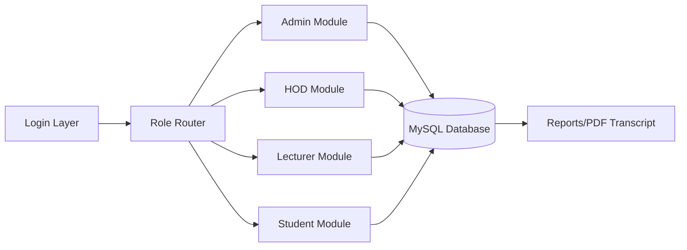

# LASCOHET Student Management System


An enterprise-style, role-based result processing and student records platform for tertiary institutions. It supports complete result workflows from score entry to review, publishing, transcript generation, and student access.

## Live Modules

- Admin management console
- HOD review and approval workspace
- Lecturer mark entry and upload flow
- Student result and transcript portal
- Attendance and academic session management
- Course, department, and institution administration

## Core Capabilities

- Multi-role authentication (`admin`, `hod`, `lecturer`, `student`)
- Institution-aware account and access routing
- End-to-end grading workflow:
	- Draft results
	- Lecturer submission
	- HOD approval/rejection
	- Final publish
- Automated grading and GPA/CGPA calculations
- Attendance tracking with semester and course mapping
- Transcript and result slip generation (PDF)
- Audit trail logging for operational accountability

## Tech Stack

- Backend: PHP (procedural + modular includes)
- Database: MariaDB / MySQL
- Frontend: HTML, CSS, Bootstrap, JavaScript
- PDF: Dompdf
- Mail/Utility packages: Composer ecosystem
- Deployment target: XAMPP / Apache (Windows-friendly)

## Project Structure

```text
Student-Management-System/
|-- admin/                      # Admin panel pages
|-- hod/                        # HOD workflow pages
|-- lecturer/                   # Lecturer workflow pages
|-- student/                    # Student-facing pages
|-- includes/                   # Shared config/auth/functions
|-- database/                   # SQL schema and full dump
|-- assets/                     # CSS, images, logos
|-- install.bat                 # One-click Windows installer
|-- setup_database.php          # Browser-based setup fallback
|-- db.php                      # Primary DB connection
```

## One-Click Installation (Client Setup)

### Requirements

- Windows OS
- XAMPP (Apache + MySQL/MariaDB)
- PHP 8+
- Composer (optional, if dependencies are missing)

### Quick Install Steps

1. Start Apache and MySQL in XAMPP.
2. Place this project in `htdocs`.
3. Double-click `install.bat`.
4. Enter your MySQL host/user/password when prompted.
5. Wait for import to complete.
6. Open `http://localhost/Student-Management-System/`.

The installer imports the full live dataset from:

- `database/lascohet_full_dump.sql`

## Database Model

Main tables include:

- `institutions`
- `departments`
- `programs`
- `users`
- `students`
- `courses`
- `course_assignments`
- `course_registrations`
- `academic_sessions`
- `semesters`
- `result_batches`
- `results`
- `attendance`
- `grading_scale`
- `audit_trail`

## Architecture Snapshot



## Screenshots (Graphics)

.png)
.png)
.png)
.png)
.png)
.png)
.png)
.png)

## Video Walkthroughs

Add your hosted video links below (YouTube, Loom, Drive, or GitHub Releases):

- System Overview Demo: `https://your-video-link-here`
- Admin + HOD Approval Flow: `https://your-video-link-here`
- Lecturer Upload + Publish Pipeline: `https://your-video-link-here`
- Student Portal + Transcript Demo: `https://your-video-link-here`

Tip: Keep each video between 2 to 5 minutes for client-friendly review.

## Security and Access Notes

- Password hashes are stored securely with PHP password hashing.
- Role checks and access guards are implemented across modules.
- Audit logging exists for sensitive operations.
- For production deployment, set strict MySQL credentials and disable debug pages.

## Recommended Client Handover Checklist

1. Confirm Apache and MySQL autostart on client machine.
2. Run `install.bat` and verify successful import.
3. Test login for all roles.
4. Open result publishing flow end-to-end.
5. Generate one transcript PDF.
6. Backup database after first successful run.

## License and Usage

Developed for academic and institutional management demonstration and deployment use.
